# **MobiusPi Python Development Quick Start**
MobiusPi is the code name of InGateway series software and hardware products of Beijing InHand Networks Technology Co., Ltd.  <br/> The InGateway includes two main product series, InGateway900(IG900 for short) and InGateway500(IG500 for short). This document aims to explain to users how to use the MobiusPi hardware product for Python development. 
## Building the MobiusPi Development Environment
### Prepare Hardware and Network Environment
#### Connect MobiusPi to the Power Source and to a PC with a Network Cable
- Prepare IG500 Hardware  
  
  Connect IG500 to the power source and to a PC with an Ethernet cable according to the topology diagram.  <br/>
  

- Prepare IG900 Hardware  
  
  Connect IG900 to the power source and to a PC with an Ethernet cable according to the topology diagram.  <br/>
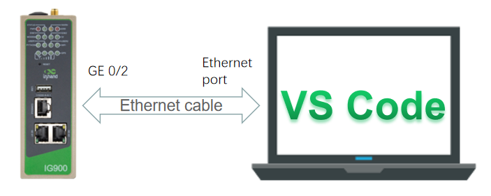
#### Set LAN Parameters
- To set the IG500 LAN network parameters, see [Access the IG500 Through LAN](https://ingateway-development-docs-en.readthedocs.io/en/latest/IG501%20Quick%20Start%20Manual.html#set-lan-parameters-access-the-ig501-through-lan).
- To set the IG900 LAN network parameters, see [Access the IG900 Through LAN](https://ingateway-development-docs-en.readthedocs.io/en/latest/IG902%20Quick%20Start%20Manual.html#set-lan-parameters-access-the-ig902-through-lan).

#### Set WAN Parameters
- To set the IG500 WAN network parameters, see [Connect IG500 to the Internet](https://ingateway-development-docs-en.readthedocs.io/en/latest/IG501%20Quick%20Start%20Manual.html#set-wan-parameters-connect-ig500-to-the-internet).
- To set the IG900 WAN network parameters, see [Connect IG900 to the Internet](https://ingateway-development-docs-en.readthedocs.io/en/latest/IG902%20Quick%20Start%20Manual.html#set-wan-parameters-connect-ig902-to-the-internet).

#### Update the Software
To obtain the latest version and updated functions, contact the customer service center. To update the software, do as follows:
- [Update the IG500 Software](https://ingateway-development-docs-en.readthedocs.io/en/latest/IG501%20Quick%20Start%20Manual.html#update-the-software)
- [Update the IG900 Software](https://ingateway-development-docs-en.readthedocs.io/en/latest/IG902%20Quick%20Start%20Manual.html#update-the-software)

#### Enable the Debug Mode of MobiusPi
If you need to run and debug Python code on MobiusPi during development, you need enable the debug mode of MobiusPi. 
- [Enable the Debug Mode of IG500](https://ingateway-development-docs-en.readthedocs.io/en/latest/IG501%20Quick%20Start%20Manual.html#enable-the-debug-mode)
- [Enable the Debug Mode of IG900](https://ingateway-development-docs-en.readthedocs.io/en/latest/IG902%20Quick%20Start%20Manual.html#enable-the-debug-mode)

### Install Software on PC
#### Install a Python Interpreter
The PC must be installed with a Python2.7.X or 3.7.X interpreter (3.7.X is recommended). You can visit https://www.python.org/downloads/ to download the installation package and install it on your PC.
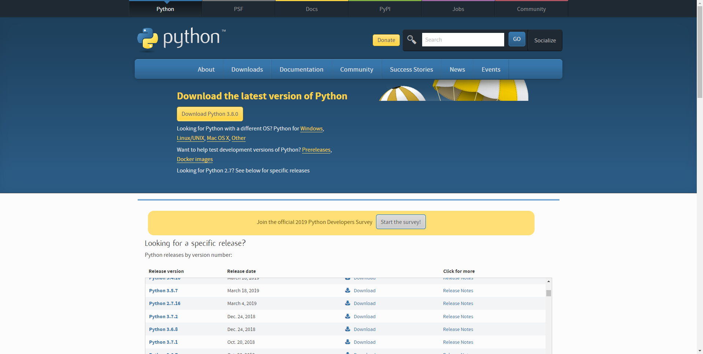

#### Install Visual Studio Code
Obtain the Visual Studio Code software (VS Code for short) from https://code.visualstudio.com/Download.
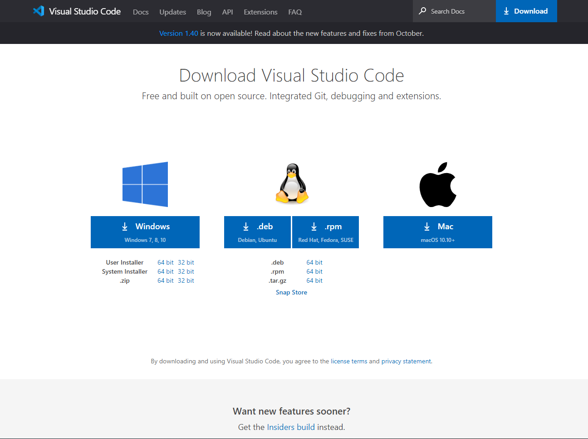
 &nbsp;

Download the software and run the installation program. After the software is successfully installed, launch the VS Code software, as shown below.

### Prepare the Development Environment of VS Code
#### Install the VS Code Plug-ins
To develop and debug Python code on MobiusPi, you need to install the following plug-ins in Extensions of VS Code IDE.  
- `Python`: a VS Code Python plug-in with abundant functions and features, including IntelliSense, linting, debugging, code navigation, code formatting, Jupyter notebook support, refactoring, variable explorer, test explorer, snippets, and more! To get more information, visit the [official website](https://code.visualstudio.com/docs/languages/python) of the plug-in.  
- `Project Templates`: a VS Code extended plug-in used to quickly create projects based on custom templates. We will release several Python App templates. You can use Project Templates to import templates and quickly initialize projects.  
- `SFTP`: used to upload code to IG500 with the SFTP Sync plug-in.
  

    

  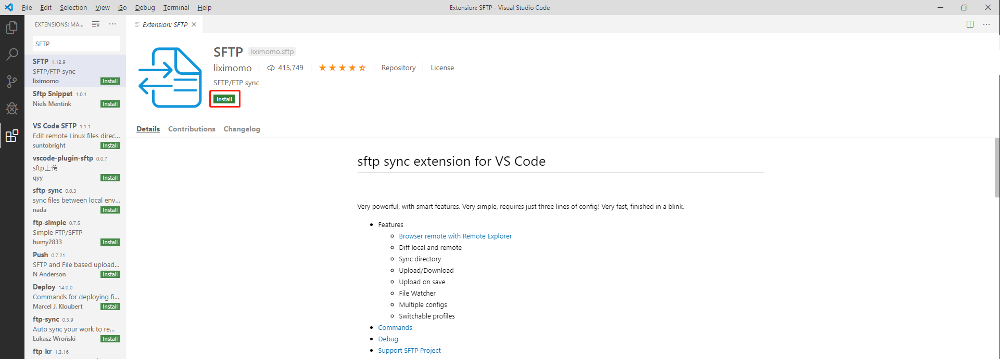  
 &nbsp;

Now, all the plug-ins required for developing MobiusPi edge computing platform are installed. To know more about VS Code plug-ins, visit [Visual Studio Code official website](https://code.visualstudio.com/).

#### Configure the Python Interpreter Version
Use the shortcut keys `Ctrl+Shift+P` to display the command interface. Enter `>Python:select Interpreter`  in the command interface.

 &nbsp;

Select the required Python interpreter. In this source, Python 3.7.X interpreter is used. (The selected interpreter version should be the same as that in Edge Computing > Python Edge Computing > Edge Computing Engine.) Then the selected Python interpreter version is displayed on the left bottom of the VS Code interface.
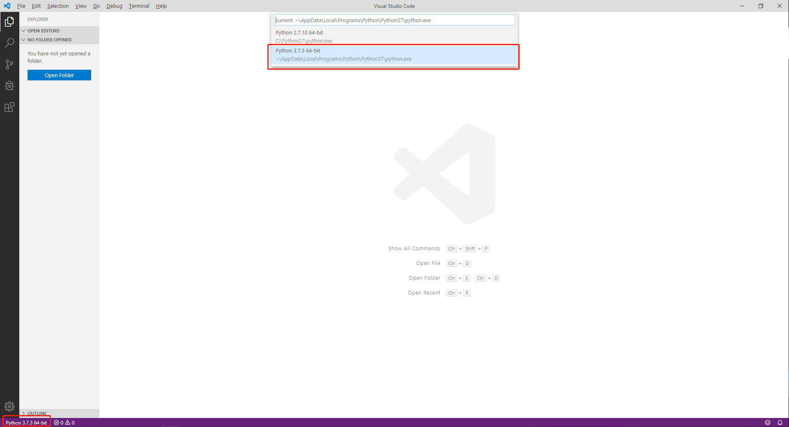

#### Configure Project Templates
##### Use the Standard Project Templates of InHand
- Step 1: Download MobiusPi project template from [here](https://github.com/inhandnet/MobiuspiProjectTemplates/releases).  </br>
MobiusPi provides various project templates for you to quickly initialize project directories. For details about project templates, see [README.md](https://github.com/inhandnet/MobiuspiProjectTemplates). This course uses the standard project template "helloworld-template" as an example.  

 &nbsp;

- Step 2: Open a project template.  </br>
Decompress the downloaded project template package, run VS Code to open the helloworld-template folder, choose File > Open Folder, and select the helloworld-template folder.

 &nbsp;

  Open the project template folder helloworld-template, as shown below. The project template includes:
  - `.vscode`: VS Code configuration folder
    - `sftp.json`: SFTP plug-in configuration file, used to set up SFTP connections with the MobiusPi
  - `build`: folder of App release package
  - `src`: folder of App source code
    - `main.py`: App entrance
    - `parse_config.py`: App configuration file parsing
  - `config.yaml`: App configuration file
  - `setup.py`: information such as App version and SDK version  

  
 &nbsp;

- Step 3: Enter `>Project:Save Project as Template` on the command interface to save the current project file as a template.

 &nbsp;

  Name your template, for example, helloworld-template.


##### Customize Project Template
- Step 1: Create a project template folder, which must include the following content. You can add other information according to your needs.
  - `.vscode`: VS Code configuration folder (Entering `>SFTP:Config` on the VS Code command interface can quickly create a .vscode folder and an sftp.json file.)
    - `sftp.json`: SFTP plug-in configuration file, used to set up SFTP connections with the MobiusPi
  - `build`: folder of App release package
  - `src`: folder of App source code
    - `main.py`: App entrance
  - `config.yaml`: App configuration file, of which the content can be customized
  - `setup.py`: information such as App version and SDK version. It is recommended to customize the information based on the standard template.  
   &nbsp;

- Step 2: Run VS Code to open the custom project template folder, choose File > Open Folder, and select the custom project template folder.
 &nbsp;

- Step 3: Enter `>Project:Save Project as Template` on the command interface to save the current project file as a template.

## Compiling the First MobiusPi App: Hello World
In this course, an App named HelloWorld is used as an example to describe how to develop Python Apps with VS code on MobiusPi. This App can print a "hello world!" log on MobiusPi every 10s, import configuration files to modify log content.
### Use Template to Create Project
- Step 1: Use VS Code to open the Python App project folder, as shown below:
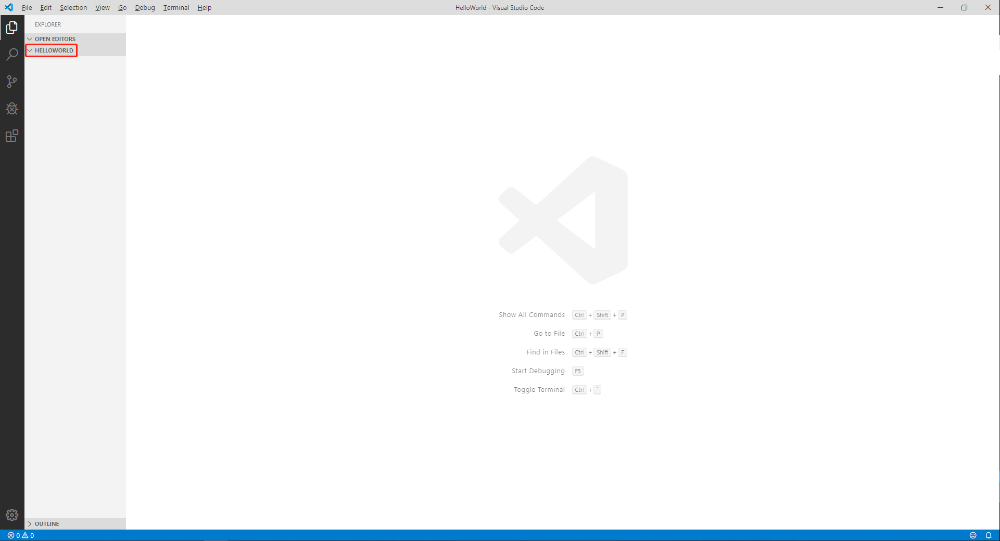
 &nbsp;

- Step 2: Enter `>Project:Create Project From Template` on the command interface to quickly create a project directory by using an existing template.

 &nbsp;

- Step 3: Enter the template name of helloworld-template and press Enter.

 &nbsp;

  After you select a template, VS Code automatically adds the files included in the template to the current project directory.


### Coding
The standard project template helloworld-template can print a "hello world!" log on MobiusPi every 10s, import configuration files to modify log content. To change the App name, modify the code in `main.py` and `setup.py` as follows: <font color=#FF0000>(Note: The Python App names cannot contain spaces.) </font>
  


### Debugging
#### Set Up an SFTP Connection
Before debugging code remotely, you need to upload the local code to a remote server, namely, the MobiusPi. Before uploading the code, ensure that the debug mode of MobiusPi has been enabled as follows:
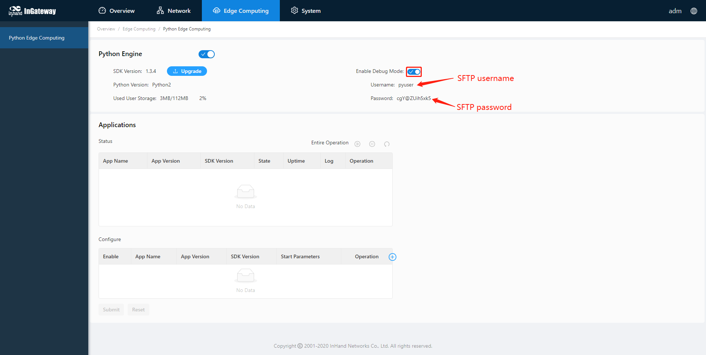
 &nbsp;

- Step 1: Open the `sftp.json` file.  <br/>
  Enter `>SFTP:Config` on the command interface to open the `sftp.json` file.

 &nbsp;

- Step 2: Configure the SFTP connection.  <br/>
  - Configure the IG500 SFTP connection  
  
    In the `sftp.json` file, configure the SFTP connection according to the parameters on the Edge Computing > Python Edge Computing interface.
  <font color=#FF0000>Note: The Python App name must be the same as the App name in `mian.py`. </font>

    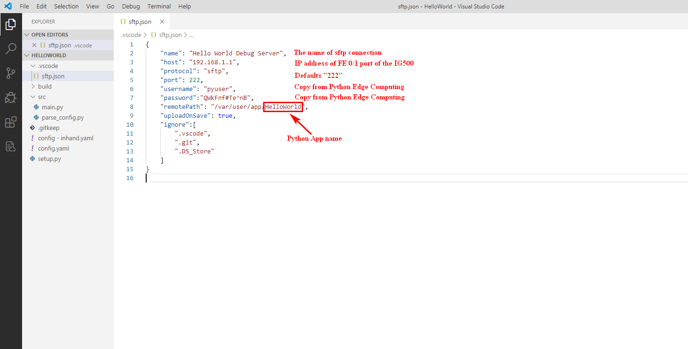  

   &nbsp;

  - Configure the IG900 SFTP connection  
  
    In the `sftp.json` file, configure the SFTP connection according to the parameters on the Edge Computing > Python Edge Computing interface.
  <font color=#FF0000>Note: The Python App name must be the same as the App name in `mian.py`. </font>

    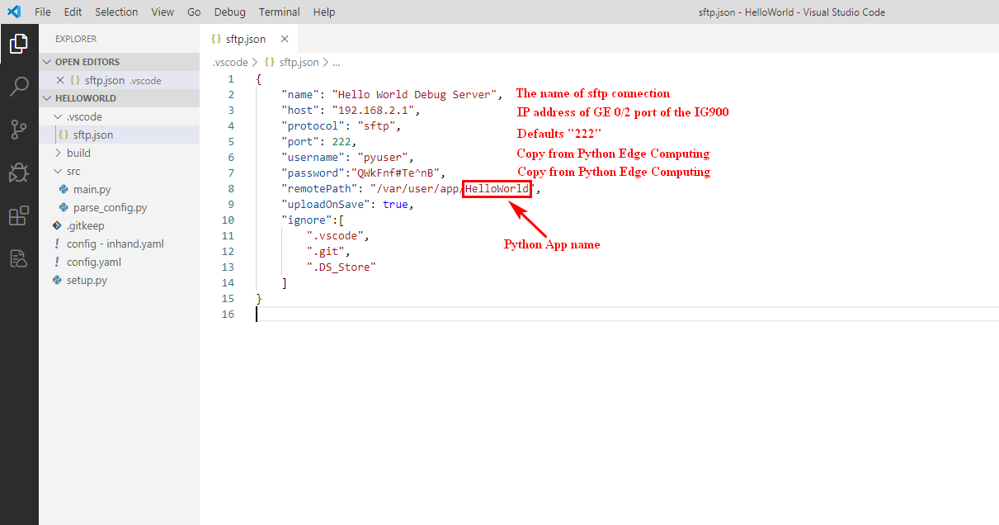  
<br/>

- Step 3: When the configuration is completed and saved, enter `>SFTP:Open SSH in Terminal` on the command interface to connect to the remote server.

 &nbsp;

- Step 4: You are prompted to enter the SFTP server's IP address, namely, host.

 &nbsp;

- Step 5: If it is the first time to set up the SFTP connection, the TERMINAL window displays a message asking you whether to continue the connection. Enter Yes and press Enter. Enter `>SFTP:Open SSH in Terminal` and SFTP server's IP address on the command interface again.
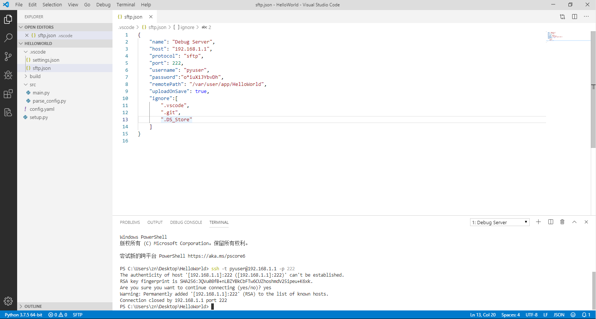
 &nbsp;

- Step 6: When the TERMINAL window prompts you to enter the password, you only need to copy the password in the `sftp.json` file.
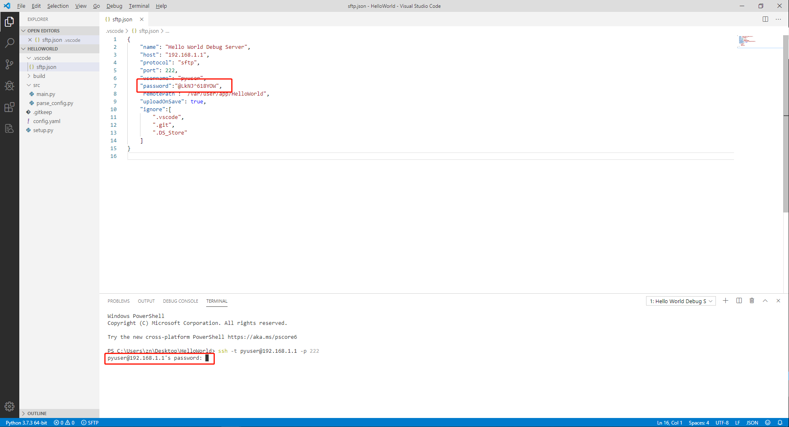
 &nbsp;

  When the SFTP connection is successfully set up with MobiusPi, the following information is displayed:


#### Debug Code
- Step 1: Synchronize code.
  After the SFTP connection is set up, right-click on a blank space in the left area and choose Sync Local > Remote from the shortcut menu to synchronize the local code to the remote server. After the code is synchronized, the modification or deletion of the local code will also be synchronized to the remote server.

 &nbsp;

  You can check whether the remote server has received the App code in TERMINAL window. Enter the following commands in the TERMINAL window to show the uploaded App folder information:
  ```
  cd app  
  ls -l
  ```
  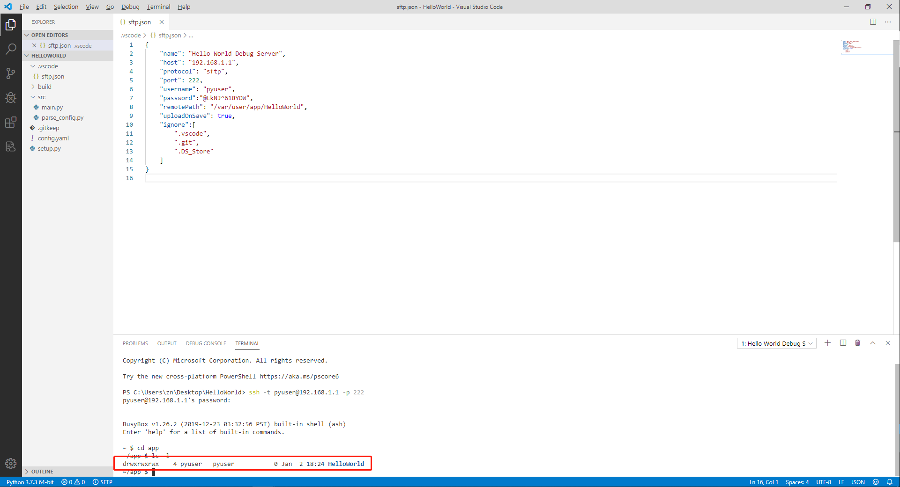
 &nbsp;

- Step 2: Debug the script in the TERMINAL window.
  After the code is synchronized, enter the command as follows to run the script on IG500. When the script is running, check whether the running result in the TERMINAL window printing "hello world!".
  ```
  python -m ptvsd --host 192.168.1.1 --port 3000 HelloWorld/src/main.py 
  ```
  - `192.168.1.1`: IP address of FE 0/1 on IG500 (<font color=#FF0000>When using IG900, the IP address of GE 0/2 port should be filled in here</font>)
  - `3000`: recommended debugging port number
  - `HelloWorld/src/main.py`: execution path of `mian.py`, which should be modified according to your needs.  <br/>
&nbsp;

  The Python development environment of MobiusPi has a built-in ptvsd dependent library for remote code debugging. To learn about more usage information about ptvsd plug-in, see [ptvsd usage](https://github.com/microsoft/ptvsd/).
  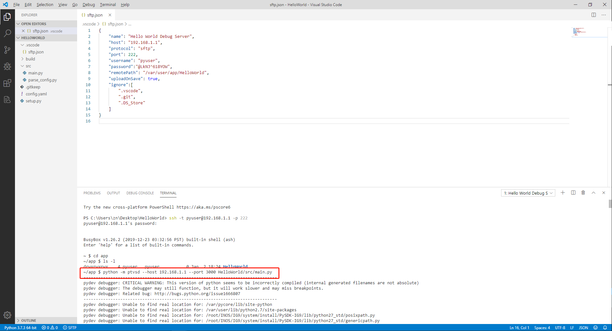  

  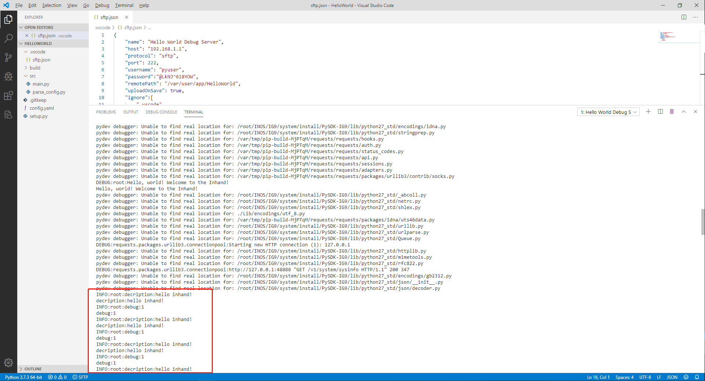
 &nbsp;

- Step 3: After debugging is completed, press `Ctrl + C` on terminal to terminate the debugging.


### Construct App Release Package
When the debugging is completed, you can construct the App release package so that the App can be quickly deployed to other MobiusPi.
- Step 1: Construct an App release package.  <br/>
  Run the `build_py_app.sh HelloWorld` command in the TERMINAL window to construct an App release package, namely, the build_py_app.sh Python App name.

 &nbsp;

- Step 2: Download the App release package.  <br/>
  An App release package is automatically generated in the build directory on the remote server. Right-click the local build folder and click Download Folder to download the constructed App release package for future deployment.

 &nbsp;

  After the download is completed, you can see the HelloWorld App release package in the build directory.


### Deploy App on the Web Page
After you run the App release package construction command, the App is automatically generated on the connected MobiusPi, but this App cannot be started normally. Please follow the procedure to deploy App to MobiusPi:
- [Deploy App to IG500](https://ingateway-development-docs-en.readthedocs.io/en/latest/IG501%20Quick%20Start%20Manual.html#install-and-run-python-app)
- [Deploy App to IG900](https://ingateway-development-docs-en.readthedocs.io/en/latest/IG902%20Quick%20Start%20Manual.html#install-and-run-python-app)

### Check App Status
Choose Edge Computing > Python Edge Computing on the MobiusPi. You can see the running status of the App.
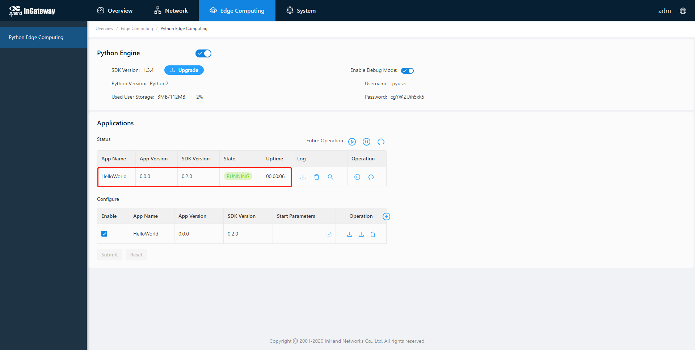

Click the log viewing icon to display the running log of the App.
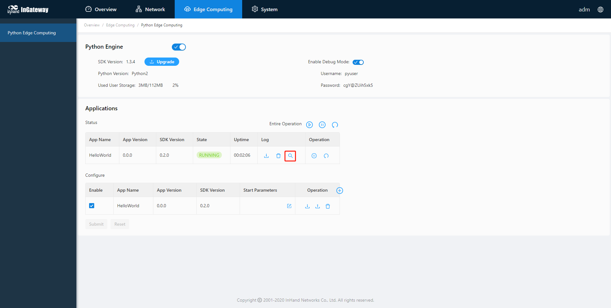  


### Update Configuration File for App
- Step 1: Modify the configuration file.  <br/>
  Modify ```description:"hello world!"``` in the config.yaml file of the App into  ```description: "hello inhand!"```.  <br/>
 <br/>
 &nbsp;

- Step 2: Import the configuration file and restart the App.  <br/>
  Choose Edge Computing > Python Edge Computing on the MobiusPi, import the modified configuration file of HelloWorld, and restart the App.  

 &nbsp;

After the restart, the HelloWorld App runs with the modified configuration file. That is, it prints a "hello inhand!" log every 10s.  <br/>

### Appendix
#### Use pip to Install the Dependent Library for App
To install the dependent library for App with pip, you need to enable the debugging mode for the MobiusPi and connect the MobiusPi to the Internet. The following uses the HelloWorld App to install the `xlrd` dependent library as an example to explain how to install third-party dependent libraries:
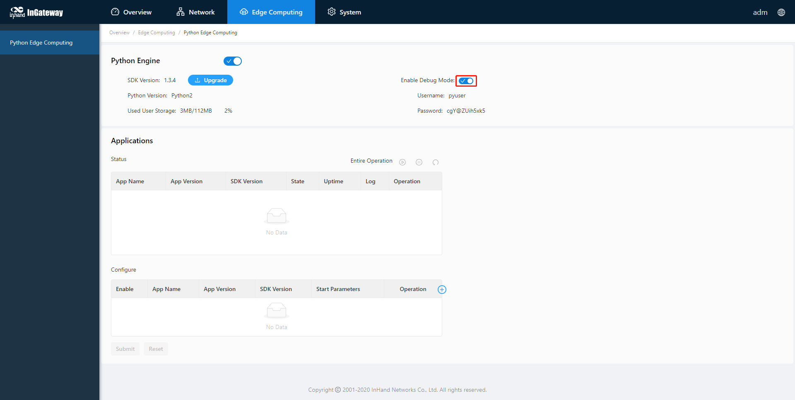  


- Step 1: Use VS Code to set up an SFTP connection with the MobiusPi. For details, see [Set Up an SFTP Connection](https://ingateway-development-docs-en.readthedocs.io/en/latest/QuickStart.html#set-up-an-sftp-connection).
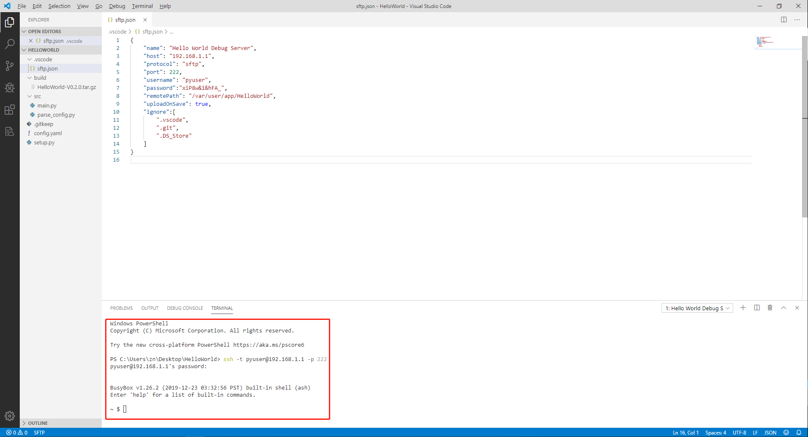
 &nbsp;

- Step 2: Run pip install + dependent library name + ==version number + -t + lib folder path of the App, and press Enter to install the dependent library. (If the version number is not included, pip automatically installs the dependent library of the latest version.) 
  ```
  pip install xlrd==1.2.0 -t /var/user/app/HelloWorld/lib/
  ```

  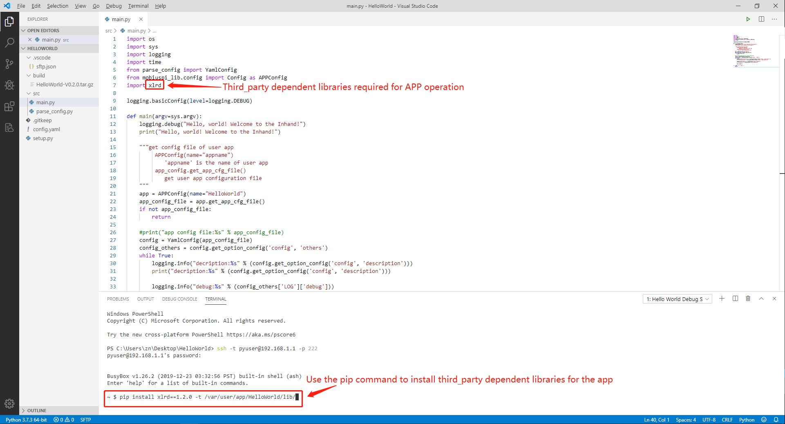
 &nbsp;

- Step 3: The dependent library is automatically downloaded and installed. When the installation is successful, the following information is displayed.

 &nbsp;

- Step 4: Run the `export` command to set the environment variables for the App. Run the following commands in the TERMINAL window.
  ```
  export LD_LIBRARY_PATH=$LD_LIBRARY_PATH:/var/user/app/HelloWorld/lib/  
  export PYTHONPATH=$PYTHONPATH:/var/user/app/HelloWorld/lib/
  ```
  
 &nbsp;

  If a dependent library is installed for the App, you must configure the environment variables for the App before debugging; otherwise, the App cannot run normally during debugging.   
  After enabling the App in MobiusPi, the environment variables of the third-party dependent library in the App's lib folder will be automatically added to the App, without manual configuration.<br/>
 &nbsp;

- Step 5: Execute code to ensure that the App runs normally.
  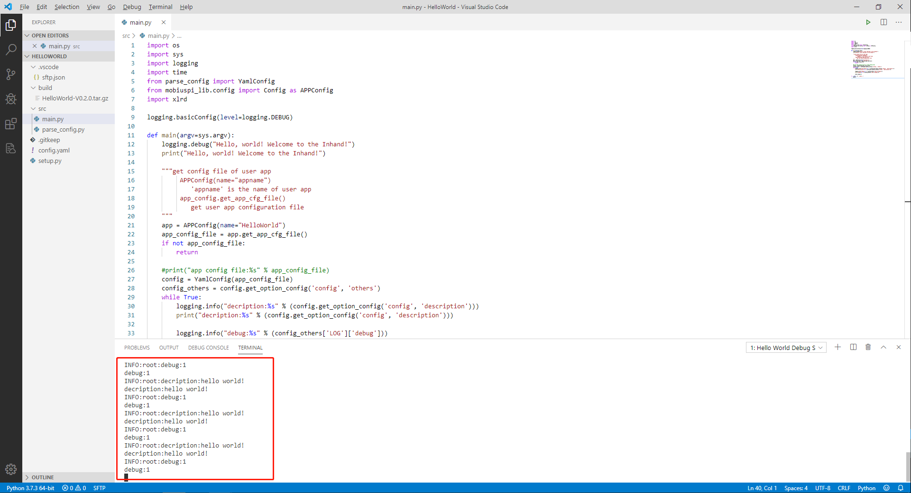

#### Enable Automatic Code Completion
To improve the coding efficiency, enable automatic code completion by using Python extended plug-ins.
- Step 1: Choose File > Preferences > Settings.
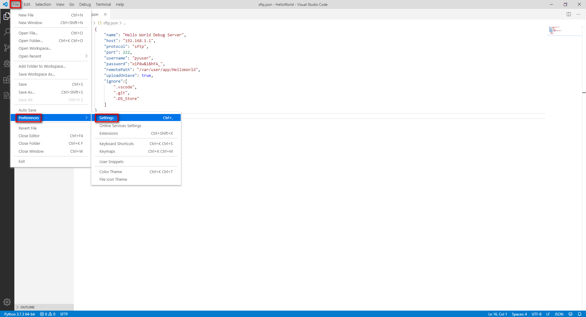
 &nbsp;

- Step 2: Choose Extensions > Python. Find out Auto Complete: Extra Paths and click Edit in setting.json.

 &nbsp;

  Add the following items to settings.json and save the settings (python.pythonPath is the installation path of the Python interpreter.)
  ```
  "python.linting.pylintEnabled":false,
  "python.linting.flake8Enabled":true,
  "python.jediEnabled":true,
  "terminal.integrated.rendererType":"dom",
  "explorer.confirmDelete":false,
  "python.pythonPath":"C:/Users/zn/AppData/Local/Programs/Python/Python37",
  ```
  

#### FAQs
- Q1: What Can I Do If the Remote Host Key Is Change and Verification Fails During the Setup of an SFTP Connection?
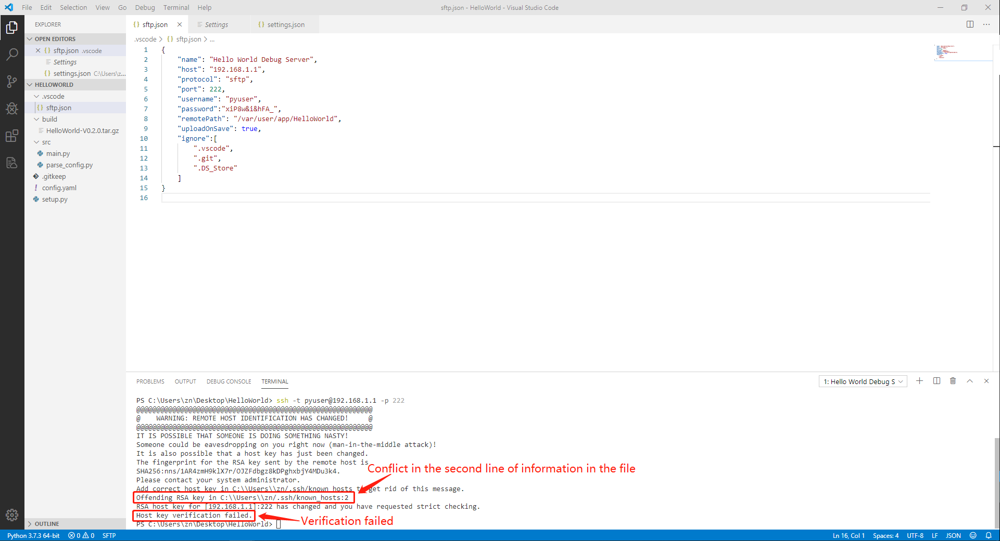
 &nbsp;

  A1: The possible reason is that the key of MobiusPi has been changed, but the key on the PC has not been updated. Therefore, the verification fails. You only need to delete the conflict line in the key file. (Pressing Ctrl and clicking the conflict item at the same time can quickly access the link.)
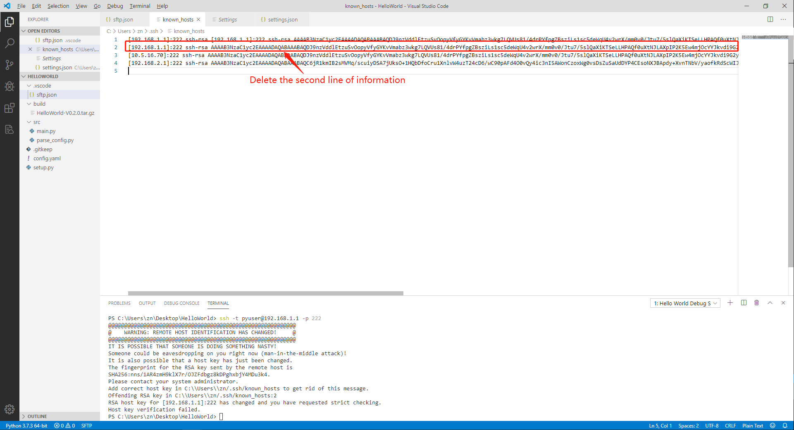
 &nbsp;

  After the deletion, run the `>SFTP:Open SSH in Terminal` command again to create the SFTP connection.

 &nbsp;

- Q2: After the SFTP Connection Is Successfully Set Up, I Right-Click the Blank Space in the Left Area, and Choose Sync Local > Remote to Synchronize Code to the Remote Server. However, All Authentication Methods Fail. What Can I Do?
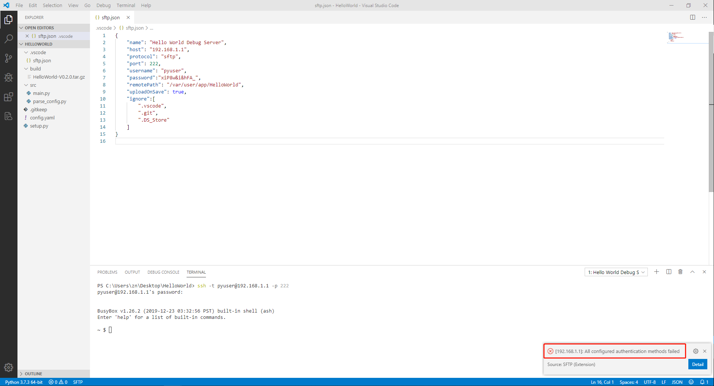
 &nbsp;

  A2: Ensure that the password in the sftp.json file is the same as the password of the MobiusPi. Then set up the SFTP connection and synchronize code again.
